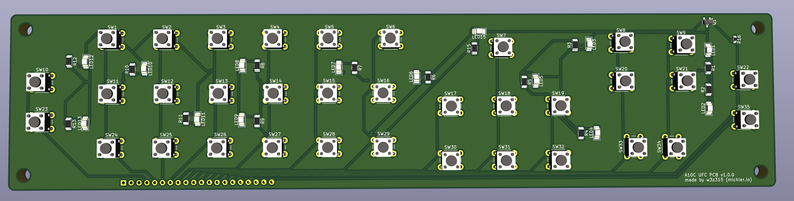

# A-10C Upfront Control Panel (UFC) PCB

Welcome to the repository for my very first PCB design, crafted specifically for an A-10C cockpit simulator project. This project has been a labor of love, a lot of learning, and yes, a few missteps - but that's the beauty of DIY!

## About the Project

The A-10C UFC PCB is for my custom A-10C cockpit control panel. You can read all about my journey [on my blog](https://mahrt.io/diy-a-10c-upfront-control-panel-pcb/).

## Repository Contents

Inside this repository, you'll find all the KiCad files used to create the PCB. Feel free to browse through them, use them as a reference, or even contribute to improving the design.

## Issues and Contributing

If you notice any issues or if you've got suggestions for improvements, don't hesitate to open an issue or a pull request. This project is all about community and collaboration.

## License

This project is licensed under the GNU GPLv3 License - see the [LICENSE](LICENSE) file for details.

## Acknowledgements

- Thanks to the open-source community for providing the tools and resources that made this project possible. (Winks to Kicad 8!)
- A shoutout to all the DIYers and hobbyists who inspire me every day.
- TheWarthogProject.com - dude, you're amazing!

Happy building!

# Notes
The image of the manufactured PCB is v1.0 which contained a lot of mistakes! (oopsie). I'll update it as soon as the new ones arrive!